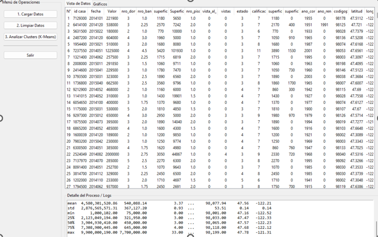
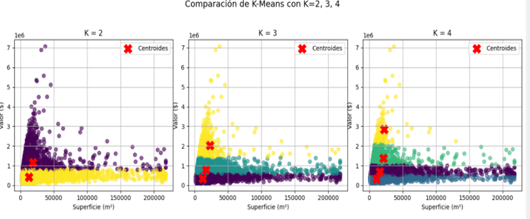
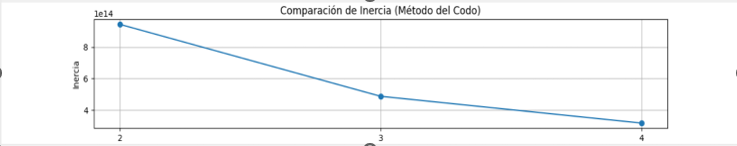

# Sistema de Minería de Datos: GUI K-Means

Aplicación de escritorio (Tkinter) para cargar datos desde Excel, limpiar y validar registros según reglas de negocio, y analizar agrupamientos (K-Means) con visualización interactiva.

## Características
- Carga de datos desde Excel con renombrado automático de columnas relevantes.
- Visualización del DataFrame en una tabla con numeración estable.
- Limpieza de datos con reglas de negocio y reporte detallado en el panel de logs.
- Análisis K-Means comparando K=2, 3 y 4, con gráficos de clusters y el Método del Codo.
- Registro (logs) de cada acción con resúmenes compactos.

## Requisitos
- Windows + PowerShell
- Python 3.13

## Instalación
1. Crear entorno virtual e instalar dependencias:
```powershell
C:/Users/rcoro/AppData/Local/Programs/Python/Python313/python.exe -m venv .venv
.\.venv\Scripts\Activate.ps1
pip install --upgrade pip
pip install -r requirements.txt
```

2. Recomendación en VS Code:
- Selecciona el intérprete: `Python: Select Interpreter` → `./.venv/Scripts/python.exe`.

## Ejecución
```powershell
.\.venv\Scripts\python.exe GraficoKmeansGUI.py
```

## Flujo de Uso
1. Menú "Cargar Datos":
   - Busca automáticamente `Propiedades_Precios.xlsx` en la carpeta del proyecto.
   - Permite seleccionar otro archivo Excel (`.xlsx`, `.xlsm`, `.xls`).
   - Renombra columnas comunes a:
     - `precio` → `Valor`
     - `superficietotal_pies2` → `Superficie`
     - (soporta también `precio_usd` y `metros_cuad`)
   - Muestra estadísticas iniciales en logs y la tabla con numeración.

2. Menú "Limpiar Datos":
   - Aplica reglas de limpieza y consistencia:
     - Nulos: remueve filas con valores faltantes.
     - Duplicados exactos: remueve filas idénticas.
     - Duplicados por `id casa`: conserva el registro más reciente por `fecha`.
     - Coerción numérica: convierte `Valor` y `nro_pisos` a numérico, eliminando inválidos.
     - Ilógicos: `Superficie > 10` y `Valor > 0`.
     - Pisos: elimina filas con `nro_pisos < 0`.
     - Consistencias de superficie:
       - F≈M+N: `superficieliving_pies2 ≈ superficie_base_pies2 + superficie_arriba_pies2`.
       - F≤G: `superficieliving_pies2 ≤ superficietotal_pies2`.
       - Si `nro_pisos` = 1 entonces `superficie_arriba_pies2 ≈ 0`.
     - Precio/superficie (IQR): elimina outliers en `Valor/Superficie` por rango intercuartílico.
     - Superficie (percentiles): filtra extremos por 1%–99%.
   - Actualiza la tabla con los datos limpios.
   - Muestra un "Resumen de Limpieza" con todos los contadores.

3. Menú "Analizar Clusters (K-Means)":
   - Agrupa por `Superficie` y `Valor`.
   - Dibuja 3 gráficos (K=2, K=3, K=4) con puntos por propiedad y centroides (X rojas).
   - Muestra el gráfico del Método del Codo con la inercia para justificar K.
   - Registra centroides e inercias en logs.

## Interpretación de Clusters
- Cada color representa un segmento de propiedades con similar relación entre `Superficie` y `Valor`.
- Los centroides marcan el “promedio” de cada segmento.
- K más pequeño → menos segmentos (grupos amplios). K más grande → más detalle.
- El “codo” de la curva de inercia sugiere un K razonable.

## Capturas
Inserta aquí las capturas en la carpeta del proyecto y ajusta los nombres de archivo si difieren.

- Vista general y tabla:
  

- Gráficos K-Means (K=2,3,4):
  

- Método del Codo:
  

> Nota: si ya tienes las imágenes, colócalas en `GraficoKmeans/docs/` con esos nombres.

## Campos relevantes vs. irrelevantes
- Relevantes para el K-Means actual: `Superficie`, `Valor`.
- Usados para validaciones: `superficieliving_pies2`, `superficie_base_pies2`, `superficie_arriba_pies2`, `superficietotal_pies2`, `nro_pisos`, `id casa`, `fecha`.
- Irrelevantes para el clustering (pueden ocultarse en la vista): `nro_dormitorios`, `nro_banos`, `vista_al_mar`, `vistas`, `estado`, `calificacion`, `ano_construccion`, `ano_renovacion`, `codigopostal`, `latitud`, `longitud`.

## Personalización sugerida
- Tolerancia de reglas (F≈M+N, N≈0 si `nro_pisos`=1) como parámetros de UI.
- Conversión opcional de pies² a m² y visualización en ambas unidades.
- Etiquetado automático de clusters (Económico/Medio/Lujo) según centroides.

## Problemas comunes
- "No se pudo resolver importación" en VS Code: selecciona el intérprete `.venv`.
- `ModuleNotFoundError`: instala dependencias con `pip install -r requirements.txt`.
- Columnas faltantes: asegúrate de que tu Excel tiene `precio` y `superficietotal_pies2` (o sus equivalentes), o usa el diálogo para seleccionar otro archivo.

## Licencia
Uso educativo/demostrativo. Ajusta según tus necesidades.
